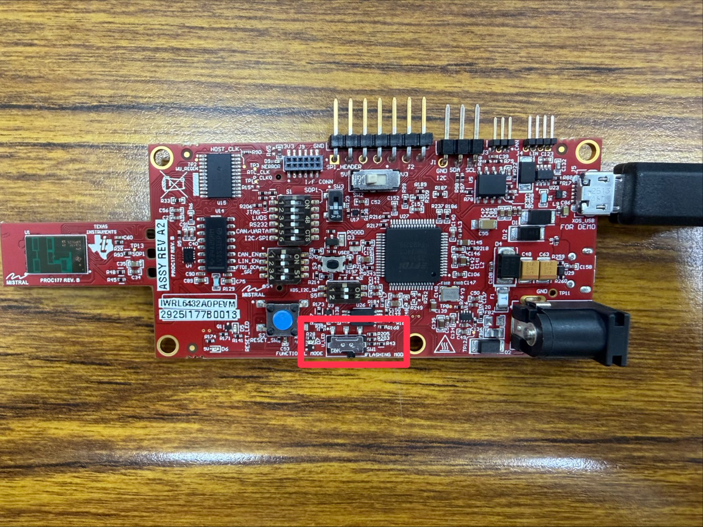
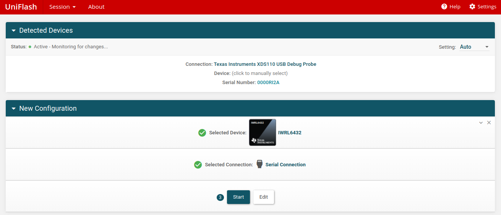
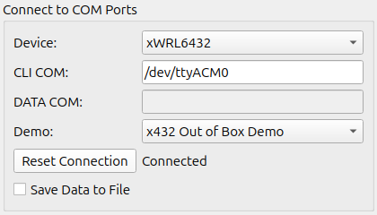
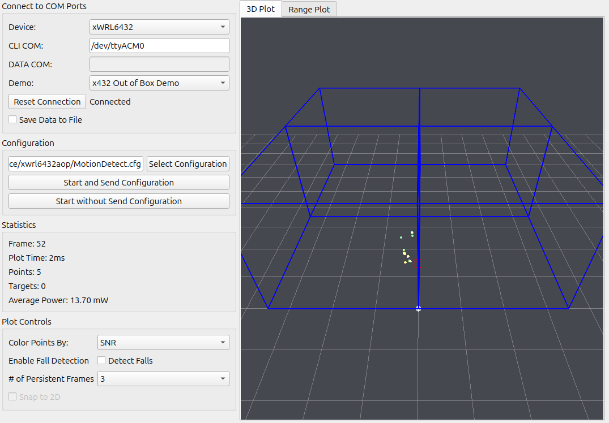

# TI-IWRL6432AOP-EVM-in-Ubuntu
This repo is written for using the TI IWRL6432AOP EVm in Ubuntu 24.04 environment.

AOP (Antenna of Package) ; EVM (Evalution Module)

## Read the DEPENDENCIES first please.

## Flash
Switch the board into Flash Mode first.


(Option1) Using uniFlash to flash the image.

Once you connect the board, the first row will detect automatically. Select the IWRL6432 in the second row, and then press **Start**.


Browse and select the image in Meta Image 1. Then enter the **COM Port** in **Quick Settings**. (In Ubuntu, the port is usually /dev/ttyACM0)

After finishing, press **Load Image**. And wait for flashing sucessfully.

(Option2) Using Python flash code inside the SDK.

```
cd ${sdk_install_dir}/tools/boot
python3 arprog_cmdline.py -p /dev/ttyACM0 -f ${path_to_.appimage} -s SFLASH -t META_IMAGE1
```

## Ubuntu Visualizer
For more information go to this: ${radar_toolbox_dir}/tools/visualizers/visualizer_overview.html

Only the Industrial Visualizer of Radar Toolbox can operate in Ubuntu environment.
To run this Python-based code. Some dependencies need to be installed first.

However, the PySide2==5.15.2.1 will conflict with the nativate Python==3.12 environment. I used the Pyenv to create a Python==3.10.14 to run the codes.

Go to the Industrial Visualizer directory and start.
```
cd ~{radar_toolbox_dir}/tools/visualizers/Applications_Visualizer/Industrial_Visualizer
python3 gui_main.py
```

Connect the board with computer, and then select the device, CLI COM, and Demo.


Select the configuration, and click the **Start and Send Configuration**.


### Data Type
TLV (Type Length Value)

Each demo has different TLV. For more information, visiting this:
```
${radar_toolbox_dir}/software_docs/Understanding_UART_Data_Output_Format.html
```
